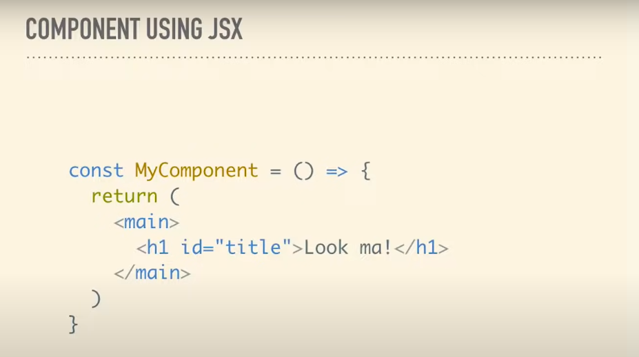
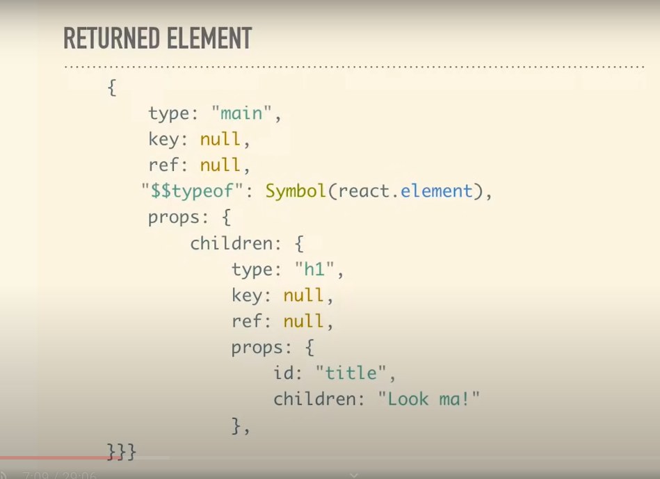
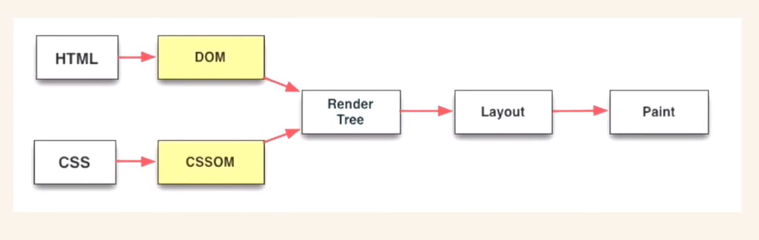
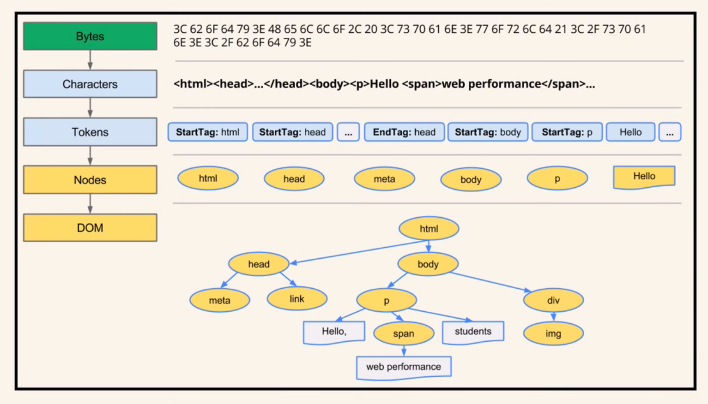
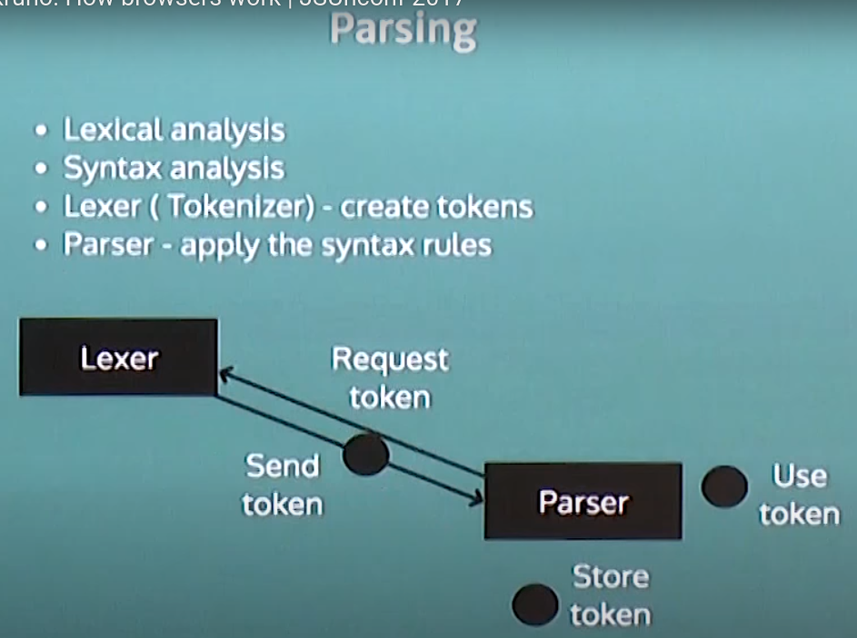
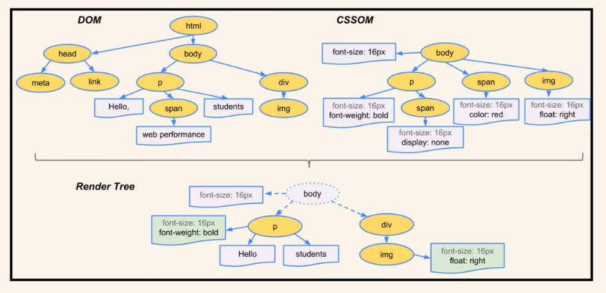
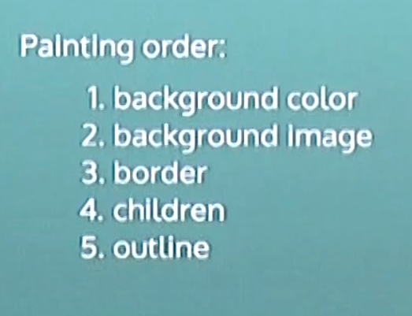

# React

### To Learn

- [ ] React hooks useRef, useMemo, useCallback all
- [ ] Better ways to style in React with SASS SCSS
- [ ] Ways to bulid more modular and reuseable, with different behaviiours

## React Hook's Internal Working Mechanisim

```jsx
const React = {
  index: 0, // state index
  state: [], // state store
  useState: (defaultProp) => {
    const cachedIndex = React.index;
    if (!React.state[cachedIndex]) {
      React.state[cachedIndex] = defaultProp;
    }

    const currentState = React.state[cachedIndex];
    const currentSetter = (newValue) => {
      React.state[cachedIndex] = newValue;
    };
    React.index++;
    return [currentState, currentSetter];
  },
  useEffect: (callback, dependencies) => {
    const cachedIndex = React.index;
    const hasChanged = dependencies !== React.state[cachedIndex];
    if (dependencies === undefined || hasChanged) {
      callback();
      React.state[cachedIndex] = dependencies;
    }
    React.index++;
    return () => console.log("unsubscribed effect");
  },
  render: (Component) => {
    const exampleProps = {
      unit: "likes",
    };
    const compo = Component(exampleProps);
    console.log("Render: ", compo.inner);
    React.index = 0; // reset index
    return compo;
  },
};

const Component = (props) => {
  const [count, setCount] = React.useState(0);
  const [name, setName] = React.useState("Steve");

  const exitThis = React.useEffect(() => {
    console.log("Effect ran");
  }, name);

  return {
    type: "div",
    inner: `${count} ${props.unit} for ${name}`,
    click: () => setCount(count + 1),
    personArrived: (person) => setName(person),
    unsubscribe: () => exitThis(),
  };
};

let App = React.render(Component); // render
// state: [ 0, 'Steve' ]
// Effect ran
App = React.render(Component); // re-render
// state: [ 0, 'Steve', 'Steve' ]
// Effect does not run
App.click();
App = React.render(Component); // re-render
// state: [ 1, 'Steve', 'Steve' ]
// Effect does not run
App.click();
App.personArrived("Peter");
App = React.render(Component); // re-render
// state: [ 2, 'Peter', 'Steve' ]
// Effect ran

App.unsubscribe();
// "unsubscribed effect"
```

> ## Note
>
> - React hook keeps an array internally to store states, dependency array, memo, callback etc.
> - Data is stored sequentially
> - As the excution stack of the component reads line by line data is stored and `index++`, so next hook call will store the data on next cell
>
> - When, react render the compnent it make `index = 0`
> - When, component re-render same lines of instructions are executed line by thus `index++` and hooks read data from on same `index` number it previously excuted or stored
>
> - `import {useState, useEffect} from 'react'` bascially means we're coping the exact line but freshhly on top of oure code, so none of ohter component that are using hooks gets know about other's `hook's array`

## How Does `useState` Cause Update or How Does React Update Work?

## React VirtualDOM



Also a
[source refference](https://youtu.be/i793Qm6kv3U)

## What Is React Render And How React Renders?

### Browser Rendering Process

#### Browser Component


#### Browser Render Engine Proccessing Flow



#### HTML Parsing


CSS parsed in same order

### About Parsing


HTML needs unconventiona parser because,

- HTML is not context free
  - Reads character by character parses into tokens and dpending on the content it auto-closes the unclosed tags following the tag closing rule it has inside.
- HTML DOCUMENT TYPE imposses some rules for parsing that defined by w3c
  

**vocabulary** are words, here veriables or intergers and operators.
**Syntax rules** are rule that such as `+` operator should be used only with one veribae or expression on each side.


### Remder Tree



- Render tree only contains element that is visible to user or need be render
- Elements are in the oder as they going to be displayed
- Element in Render tree called render objects, these are small units and they rectangles
- Render tree generated by combining CSSOM and DOM

### Layout


- Free up the machine by, re-layout locally when some interaction happend and  not re-rendering whole tree


- Global re-layotu re-rednders everything, such as when browser size changes or fotn changes
- Icremental re-layout uses dirtybit system that changes some of the elements not every elements.

[Layouting visual demo](https://youtu.be/ZTnIxIA5KGw)

### Painting

- Render tree is traversed and `paint()` methods are called, recursively
- It also follow Global re-paint and Incremental re-paint like Layout
- [video example](https://youtu.be/n1cKlKM3jYI?t=200)
  

